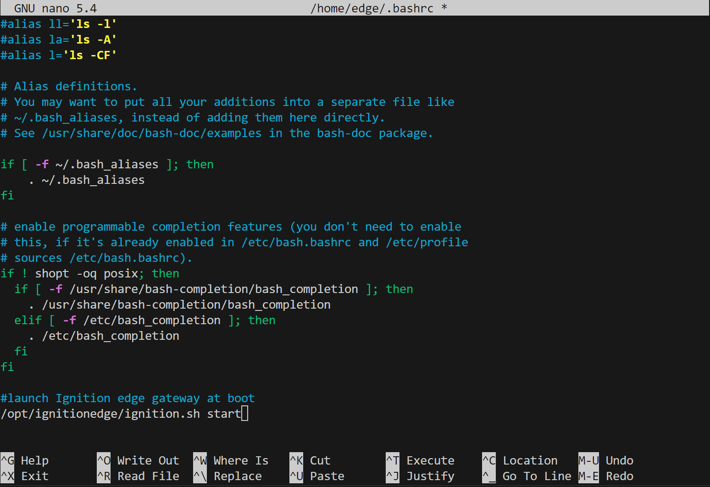
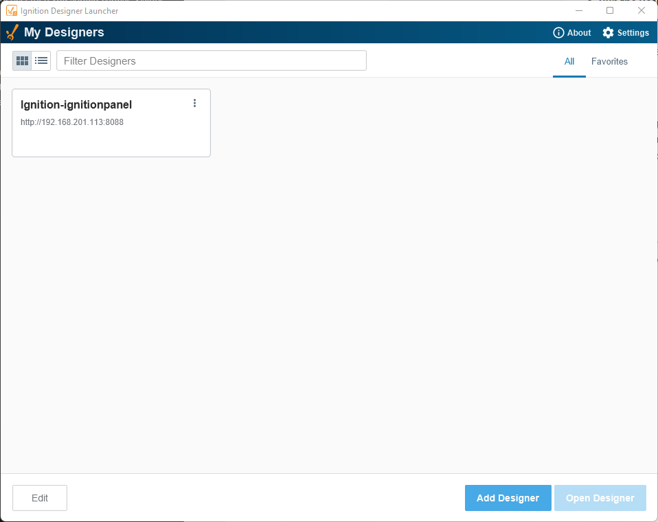
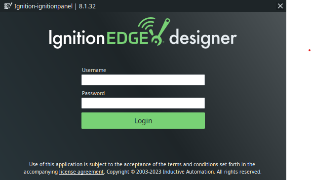
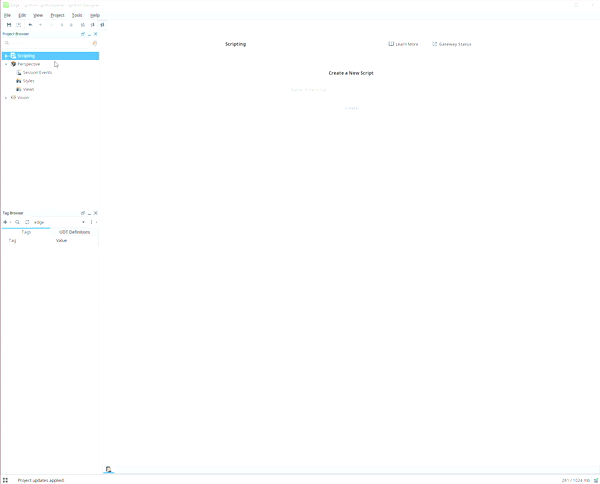
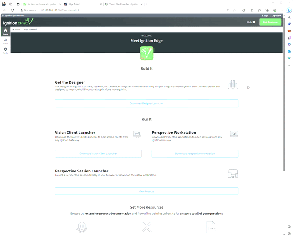

# reterminal-ignition-edge-panel
Instructions on how to setup a Seeed Studio ReTerminal DM with Ignition Edge Panel software

# Hardware Prerequisite
- reTerminal DM x 1
- PC / Mac with SSH terminal capability
- PC / Mac with available hard drive capacity to install Ignition's Designer applciation.
- 12-24V DC power supply
- Ethernet cable

*This guide assumes your reTerminal DM is running a fresh install of Raspberry Pi OS(x64) with SSH terminal access from another client device. See [instructions to flash the ReTerminal DM operating system](https://wiki.seeedstudio.com/reterminal-dm-flash-OS/#steps-for-flashing-raspbian-os) if you require detailed instructions on this procedure.*

# Installing Ignition Edge On ReTerminal

To install Ignition Edge on your device is simple.

1. Visit [Ignition's Download Page](https://inductiveautomation.com/downloads/)
2. Download the version of the application you wish to use - you will be prompted to enter your information before you can download the package
3. Copy the compressed package to your edge device, where you wish it to be installed (I have chosen a location under /opt/)
4. Extract the package at the current location
5. Delete the leftover original package
6. Modify permissions to execute the Ignition start script
7. Launch the Igntion start script

A convenience script has been written that follows these steps and does not require you to create a user login for Inductive Automation's site. To use it, you simply need to get the ignition edge download/install script. Once you've downloaded the script, mark it as executable and run it. You will need superuser credentials in order to create the necessary directories. Go ahead and grab a coffee, this will take a few minutes to install.

```bash
curl -o download-ignition-edge.sh https://raw.githubusercontent.com/tulsasoftware/reterminal-ignition-edge-panel/main/download-ignition-edge.sh
sudo chmod +x ./download-ignition-edge.sh
sudo ./download-ignition-edge.sh
```

## Uninstalling

If you wish to uninstall the package (as installed by the installer script), simply download and execute the uninstall script. Inductive Automation does not suggest a default location for their application, so *this will only work for this custom installation*.

```bash
curl -o uninstall-ignition-edge.sh https://raw.githubusercontent.com/tulsasoftware/reterminal-ignition-edge-panel/main/uninstall-ignition-edge.sh
sudo chmod +x ./uninstall-ignition-edge.sh
sudo ./uninstall-ignition-edge.sh
```

# Launching Ignition Edge Gateway

When the installation is complete you will need to start the service. You can [setup the gateway to start on boot](#configuring-ignition-edge-to-launch-on-boot) and perform a reboot of the ReTerminal or you can choose to start the service manually.

 ```bash
sudo /opt/ignitionedge/ignition.sh start
```

You can easily check if the service is running if you are able to load the Ignition Edge license agreement page. Launch a web browser either on the ReTerminal itself at `localhost:8088` OR from another device on the network at `{reterminalhostname}:8088` OR from anywhere on the network with IP address of the ReTerminal itself at `{reterminalip}:8088`.


## Configuring Ignition Edge To Launch On Boot
It is recommended to launch the gateway's service automatically on boot of the device. There are multiple ways this can be accomplished and it is ultimately up to the user to decide how to do this.

As an example, you could add the launch command to your `.bashrc`. To do this, simply open your `.bashrc` in a text editor of your choice.
```bash
sudo nano ~/.bashrc
```
Append the launch command to the the file
```bash
/opt/ignitionedge/ignition.sh start'
```

And don't forget to save the file! 
(`ctrl + x` in the example above using nano)

This method does not launch the gateway on save, so reboot the ReTerminal to ensure the script works as expected.

# Configuring Ignition Edge

Configuring the gateway is a straight forward process. Proceed by accepting the EULA and then create a default user / password for Ignition. Remember this information as it will be created with admin credentials and be used for system configuration throughout this series.


After you have a user, you will be asked if you would like to change any of the default port configurations for the installation. I do not have a network with any conflicting ports, so I have chosen to accept the defaults. These ports will be used to communicate back to the primary SCADA installation, so if you are configuring to work with an existing installation Ignition, ensure that this page matches your expected values. Note that these are the core ports used for the application, but if you choose to install modules in the future you will likely have more ports to configure later.


You are now ready to initialize and launch the service! This takes a couple minutes to setup and does not require any interaction so you are free to check back later. It will redirect to the designer home page when it is complete and you are free to begin work!


# Creating a Hello World View With Panel Designer

To verify everything is setup properly we will create a 'hello world' perspective project and view it on the gateway using a web browser.

On the gateway's home screen there is a button to download the Designer Launcher. Begin by downloading and executing this installer. It will detect your operating system and install an app on your machine with a very basic installer. After the installation is complete, it will prompt whether you would like to import your setting from the gateway - click **yes**.

Launch the newly installed Ignition Designer Launcher, it should show the connection to your device. Click on your device and and then click the 'open designer' button that is now enabled in the bottom corner.



You should now see a login prompt appear. Enter your Ignition admin credentials that were entered during the setup of your Edge Gateway.



1. In the left column, expand 'Perspectives' and right click on the 'Views'
2. Create a new view and give it a name 'hello-world'
3. Find the components pallete, which is sometimes in a hidden tab container on your right. Search for a 'label' and drag it onto the canvas.
4. Double click on the label and change your text to 'hello world'
5. Save the file and in the top menu bar navigate to File -> Update Project to publish the updated project (aka 'Perspective session') to the gateway.



Now that you've updated your Perspective session, it is live and you can navigate to it with a web browser! 
To get help finding the URL for the view we just created, you can return to the Edge Gateway Launcher and view the active Perspective sessions. This will launch a browser on your session's home page URL.



# Ignition Basics
## Expanding Your HMI
You have now setup the basics of Ignition's Perspective module to power the visuals of your ReTerminal. To create more powerful visuals leveraging the full Ignition platform, you will likely need to setup Tag Servers, Historian Databases, etc which are outside the scope of this tutorial. To learn more about the Ignition platform, use their excellent documentation and instructions for free at [Inductive University.](https://inductiveuniversity.com/)

# Licensing
Ignition Edge products requires a license for full usage in production. However, there is a trial version of the product available which has full feature support, but will clear its data every two hours. This series will not require activation of any products, although it may cause some interruption for you during the series depending on the pace you are working at while following along.

To get a license for the product, you will need to either reach out to an Inductive Automation sales representative or you can purchase your own on the [Inductive Automation Ignition pricing](https://inductiveautomation.com/pricing/ignition) page.

To enter the license, simply follow the green banner prompting you to activate ignition. Ensure your edge device has internet connectivity and enter the 6 or 8 character string and the device will take a few seconds to activate.

## Perspective Vs Vision
Ignition offers two panel builder softwares and it is a common question to decide which one to use. There is a lot of overlap in functionality between the two, but there are a couple key deciding factors to make the decision.

### Will your users be mobile-first? Choose Perspective.
If you wish to use iOS or Android native packages such as location services, or cameras you will only have access to these features through Perspective.

### Do you want to feel more native than a web browser? Choose Vision.
If you want to avoid the feel of many modern web apps (like Google Drive, Outlook for web, Zoom for web, etc) and fully immerse your user experience, then you should choose Vision.

### Will your users multi-task on this device? Choose Perspective
Perspective is a javascript-based tech stack and relies on a web browser to display the application. Vision is a Java-based application and was originally built for dedicated HMI panels and makes assumptions that the host machine will be wholly dedicated to your application. If your user will sometimes want to minimize the web browser to use another application on the operating system, you should choose Perspective.