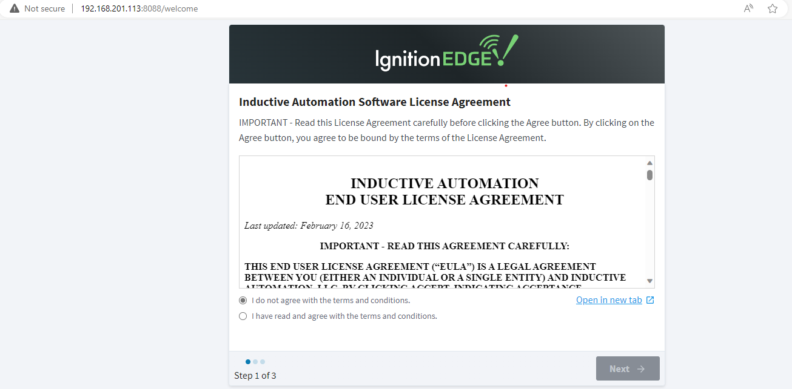
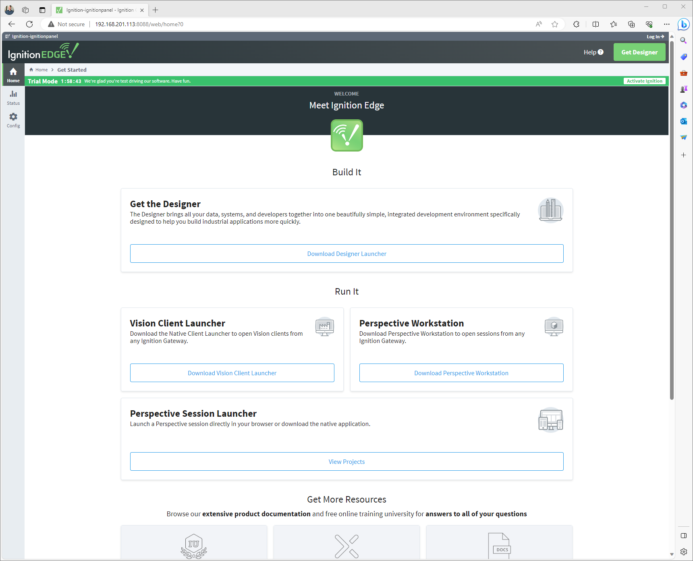

# reterminal-ignition-edge-panel
Instructions on how to setup a Seeed Studio ReTerminal DM with Ignition Edge Panel software

# Hardware Prerequisite
- reTerminal DM x 1
- PC / Mac with SSH terminal capability
- 12-24V DC power supply
- Ethernet cable

*This guide assumes your reTerminal DM is running a fresh install of Raspberry Pi OS(x64) with SSH access from another client device. See [instructions to flash the ReTerminal DM operating system](https://wiki.seeedstudio.com/reterminal-dm-flash-OS/#steps-for-flashing-raspbian-os) if you require detailed instructions on this procedure.*

# Installing Ignition Edge

From an SSH console into your ReTerminal:

Get the ignition edge download/install script. This downloads the Ignition Edge package, extracts it to the proper locations and sets it to launch on boot. Once you've downloaded the script, mark it as executable and run it. You will need superuser credentials in order to create the necessary directories. Go ahead and grab a coffee, this will take a few minutes to install.
```bash
curl -o download-ignition-edge.sh https://raw.githubusercontent.com/tulsasoftware/reterminal-ignition-edge-panel/main/download-ignition-edge.sh
sudo chmod +x ./download-ignition-edge.sh
sudo ./download-ignition-edge.sh
```

## Uninstalling

If you wish to uninstall the package (as installed by the installer script), simply download and execute the uninstall script. Inductive Automation does not suggest a default location for their application, so *this will only work for this custom installation*.

```bash
curl -o uninstall-ignition-edge.sh https://raw.githubusercontent.com/tulsasoftware/reterminal-ignition-edge-panel/main/uninstall-ignition-edge.sh
sudo chmod +x ./uninstall-ignition-edge.sh
sudo ./uninstall-ignition-edge.sh
```

# Configuring Ignition Edge

When the installation is complete there will be a notice to reboot the ReTerminal in order for the service to run. Reboot the device and when it is back online you can easily tell if the service is running if you can load the Ignition Edge license agreement page when you use a web browser either on the ReTerminal at `localhost:8088` OR another device on the network at `{reterminalhostname}:8088`.



Configuring the gateway is a straight forward process. Proceed by accepting the EULA and then create a default user / password for Ignition. Remember this information as it will be created with admin credentials and be used for system configuration throughout this series.


After you have a user, you will be asked if you would like to change any of the default port configurations for the installation. I do not have a network with any conflicting ports, so I have chosen to accept the defaults. These ports will be used to communicate back to the primary SCADA installation, so if you are configuring to work with an existing installation Ignition, ensure that this page matches your expected values. Note that these are the core ports used for the application, but if you choose to install modules in the future you will likely have more ports to configure later.


You are now ready to initialize and launch the service! This takes a couple minutes to setup and does not require any interaction so you are free to check back later. It will redirect to the designer home page when it is complete and you are free to begin work!


